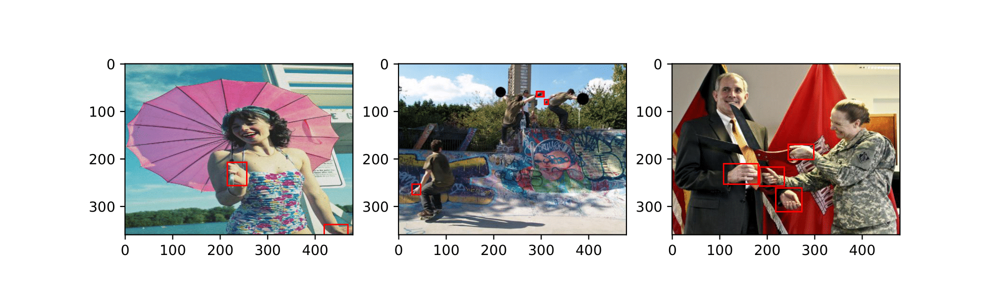
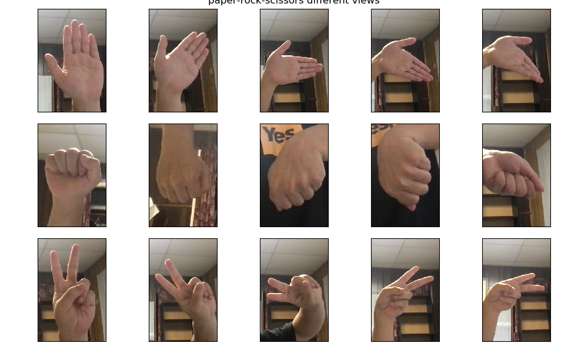
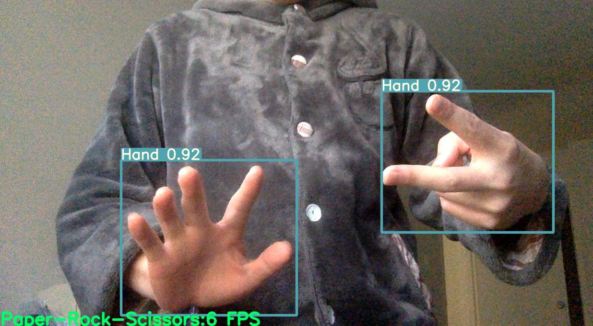

# Summary

The code is for the final project titled as **rock-paper-scissors**.
It can detect hand gestures from the live video input and classify it into one of the three classes {paper, rock, scissors}.

The hand detection feature is realized by modifying the general-purpose object detection model [YOLOv5](https://github.com/ultralytics/yolov5).
The gesture classification is realized by **Wenxuan add your description here**.

# How to use

**Wenxuan** Please add instructions on to run the code. 


# Ways to reproduce the results

## Dataset

**Hand Detector**: Datasets for training a hand detector are based on the `TV-Hand` dataset, which  contains hand annotations for 9.5K image frames extracted from the ActionThread dataset and the `COCO-Hand` dataset contains annotations for 25K images of the Microsoft's COCO dataset. 

We provide a glance of the training samples and an example of annotations follow the format



```
# class              x                 y                   w                  h
    0        0.36354166666666665 0.5166666666666667 0.07291666666666667 0.08333333333333333
```

where all the coordinates are normalized with respect to its own size using the following rule. The `(x,y)` specifies the center of the bounding box and `(w,h)` specifies the weight and the height of the bounding box.
<!-- 
```python
img_w, img_h = input_img.shape
w_scale, h_scale = 1.0/img_w, 1.0/img_h
# center of the bounding box
x_center = (box[0] + box[1])/2.0  
y_center = (box[2] + box[3])/2.0
box_w = box[1] - box[0]  
box_h = box[3] - box[2]  
x = x_center * w_scale
w = box_w * w_scale
y = y_center * h_scale
h = box_h * h_scale
``` -->
We merge them and use 25974 images for training and 7459 for validation.

**Gesture Classifier**: To train a classifier that can recognize paper, rock, and scissors from a hand gesture,we use three datasets [Kaggle-RPC](https://www.kaggle.com/drgfreeman/rockpaperscissors) dataset are generated by a Raspberry-Pi device with a webcam and are of dimension $300\times200\times3$(width$\times$height$\times$channels), whereas images from [LaurenceMoroney-RPC](https://laurencemoroney.com/datasets.html) are computer simulated and of dimension $300\times300\times3$. To minimize the distortion in the pre-processing, we rotate the images from the Kaggle-RPC dataset to get $200\times300\times3$ images and resize images from LaurenceMoroney-RPC dataset to the dimension of $200\times300\times3$. As for our dataset, we use the webcam from a labtop device to capture rock, paper, and scissors hand gestures from different angles and with/without occlusion.


We provide a glance of the training samples from our own dataset .

## Train a hand detector
To train a hand detector using YOLOv5 model, run the following commands in terminal. The following code use pre-trained `YOLOV5-nano` weights and the image size is 640.

```
# assume at the root directory of the project
cd src/yolohand/ && python train.py --data hand.yaml --weights yolov5n.pt --img 640
```

It is highly recommend to use GPU instead of CPU to train the model. I use one GPU (Tesla T4) offered by [Lehigh Research Computing Systems](https://confluence.cc.lehigh.edu/display/hpc/Hawk). If you happen to have the access, then you can use the following `slurm` script to starting training on your own.

```
#!/bin/tcsh
#SBATCH --partition=hawkgpu
#SBATCH --time=24:00:00
#SBATCH --nodes=1
#SBATCH --ntasks-per-node=4
#SBATCH --gres=gpu:1
#SBATCH --job-name yolov5
#SBATCH --output="yolov5.%j.%N.out"

cd ${SLURM_SUBMIT_DIR}
python train.py --data hand.yaml --weights yolov5n.pt --img 640
```

The trained model weights can be found at `test/yolohand/runs/train/exp/weights/best.pt`

> A caveat here is that one needs to modify the `hand.yaml` to specify the correct path to the train/val/test datasets.

To test the trained hand detector, one can run the script under `test/video.py`. One should expect to see the following result.




# Organization of the code

```
- src
    - yolohand: Contains the code for training a hand detector. The majority of the code is cloned from https://github.com/ultralytics/yolov5 with custmization specialized for this project.
        - data: hyper-parameters + yolo-format to specify the train/test/val data
        - models: model architecure; specifically, we adpot the smallest yolov5 model
        - utils: helper functions
        - train: trainning pipline
        - val: validation

- test
    - ./yolohand: Contains all training logs and the final trained model.
    - video: test trained model's hand detection performance.
        

```